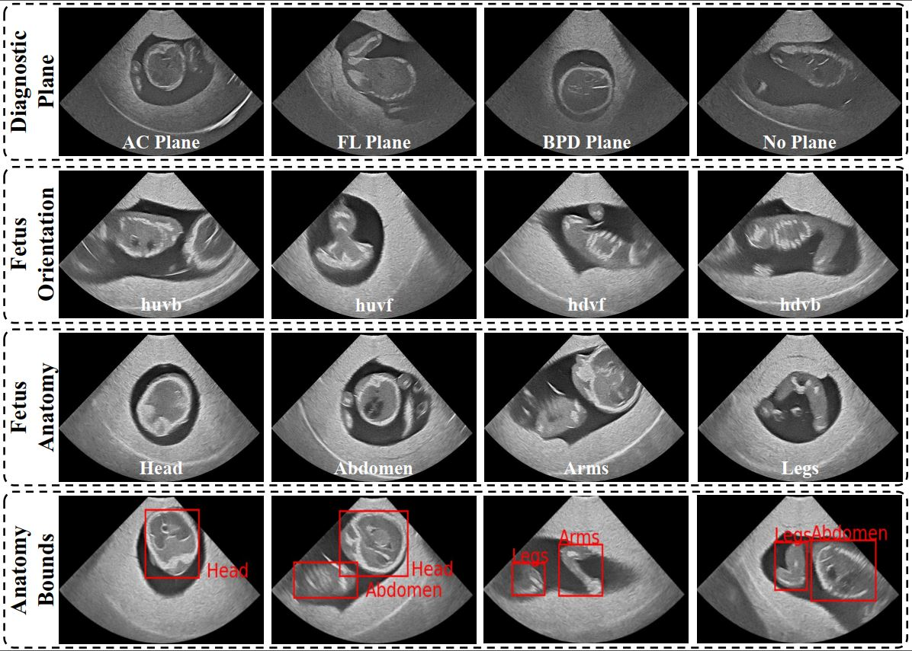

# FPUS23

"FPUS23: An Ultrasound Fetus Phantom Dataset with Deep Neural Network Evaluations for Fetus Orientations, Fetal Planes, and Anatomical Features"

## Abstract

Ultrasound imaging is one of the most prominent technologies to evaluate the growth, progression, and overall health of a fetus during its gestation. However, the interpretation of the data obtained from such studies is best left to expert physicians and technicians who are trained and well-versed in analyzing such images. To improve the clinical workflow and potentially develop an at-home ultrasound-based fetal monitoring platform, we present a novel fetus phantom ultrasound dataset, FPUS23, which can be used to identify (1) the correct diagnostic planes for estimating fetal biometric values, (2) fetus orientation, (3) their anatomical features, and (4) bounding boxes of the fetus phantom anatomies at 23 weeks gestation. The entire dataset is composed of 15,728 images, which are used to train four different Deep Neural Network models, built upon a ResNet34 backbone, for detecting aforementioned fetus features and use-cases. We have also evaluated the models trained using our FPUS23 dataset, to show that the information learned by these models can be used to substantially increase the accuracy on real-world ultrasound fetus datasets. We make the FPUS23 dataset and the pre-trained models publicly accessible at https://github.com/bharathprabakaran/FPUS23, which will further facilitate future research on fetal ultrasound imaging and analysis.

## Dataset and DNN Models

Includes annotations for images in the FPUS23 [dataset](https://drive.google.com/file/d/1LL-r2hNiP6C190UBSE4v1FFCF3OQT9N3/view?usp=sharing).

The source code for the models, including their trained versions, will be available in the final version once the paper is accepted.

## Overview of the Dataset

